Jason Yeoh | 11417889 | CPE | DISMATH EQ 
- [PROJECT 0.0 LINK](https://github.com/yeohjason/DISMATH_Project0.0_yeohjason)
- [PROJECT BONUS LINK](https://github.com/yeohjason/DISMATH_ProjectBonus_yeohjason)

## Week 1:
- In this week, I was introduced to an odd but interesting subject called **Discrete Mathematics** (DISMATH).
- I learned that a *proposition* is a declarative statement which can be either true (1) or false (0), but cannot be both.
- I've learned the usage, as well as its formulas/logical expressions, of the following logical symbols:

| Logical Symbol  |  Logical Operator | Shorthand | Formula | Logical Expression |
| :-----: |:-------:|:-----:| :-------: | :-------: |
| ¬ |Negation | not | val(¬p) = 1 - val(p) | ¬p |
| ∧ | Conjunction | and | val(p ∧ q) = min(val(p), val(q)) | p ∧ q |
| v | Disjunction | or | val(p v q) = max(val(p), val(q)) | p v q |
| ⊕ | Exclusive disjunction | xor | if val(p)  not equal val(q) = 1 , otherwise  0|  p ⊕ q  ≡ (¬p ∧ q) v (p ∧ ¬q) |
| → | Conditional | if, then | if val(p)  ≤ val(q) = 1 , otherwise  0  | p → q ≡  ¬p v q |
| ↔ | Biconditional | iff | if val(p) equals val(q) = 1 , otherwise  0 |  p ↔ q ≡ (p → q) ∧ (q → p) |
- I knew how to verify a statement by using a Truth Table.
- Also, I've learned the different propositional logic such as:
  - Inverse of p → q: ¬p → ¬q
  - Converse of p → q: q → p
  - Contrapositive of p → q: ¬q → ¬p (which also happens to be the equivalent value of the original statement)


## Week 2:
- **Terminologies** (from Chapter 1.3)
  - A **tautology** is a compound proposition that is always true, no matter what the truth values of the propositional variables that occur in it. 
  - A **contradiction** is a compound proposition that is always false. 
  - A **contingency** is a compound proposition that is neither a tautology nor a contradiction.
- If Algebra has a variety of laws and rules in solving mathematical equations, Discrete Mathematics has its own set of laws and rules too. These are called **logical equivalences**. These are as follows:

|                           Equivalence                           |         Name        |
|:-------------------------------------------------------------:  |:-------------------:|
|                      p ∧ T ≡ p <br> p v F ≡ p                   |    Identity laws    |
|                       p v T ≡ T <br> p ∧ F ≡ F                  |   Domination laws   |
|                       p v p ≡ p <br> p ∧ p ≡ p                  |   Idempotent laws   |
|                            ¬(¬p) ≡ p                            | Double negation law |
|                   p v q ≡ q v p <br> p ∧ q ≡ q ∧ p              |   Commutative laws  |
|       (p v q) v r ≡ p v (q v r) <br> (p ∧ q) ∧ r ≡ p ∧ (q ∧ r)  |   Associative laws  |
| p v (q ∧ r) ≡ (p v q) ∧ (p v r) <br>  p ∧(q v r) ≡ (p ∧ q) v (p ∧ r) |  Distributive laws  |
|              ¬(p ∧ q) ≡ ¬p v ¬q <br> ¬(p v q) ≡ ¬p ∧ ¬q          |   De Morgan's laws  |
|                 p v (p ∧ q) ≡ p <br> p ∧ (p v q) ≡ p             |   Absorption laws   |
|                     p v ¬p ≡ T <br> p ∧ ¬p ≡ F                   |    Negation laws    |

- Superman Logic HW: There are a lot variables in this statement which confuses the reader. By applying the rules of inference, we can test the validity of the argument. The argument is valid. Superman does not exist. 
- The idea behind the use of **predicate logic** is comparable to the subject-predicate relationship in English language. We can simplify the proposition or sentence into *subject* and *predicate*.
  - Ex. In the statement "j is equal to 5", the variable 'j' is the subject and the phrase "is equal to 5" is the predicate.
- We were introduced to a new topic: **Quantifiers**. The two types of quantification are the following:
  - *Universal Quantification* (∀) - "tells us that a predicate is true for every element under consideration"
    - To disprove this statement, one can use a counterexample.
  - *Existential Quantification* (∃) - "tells us that there is one or more element under consideration for which the predicate is true"


## Week 3:
- I learned that an argument is **valid** if and only if its premises and final proposition are true. If not, then they will lead to invalid argument (**fallacy**).
- **circular reasoning** or **begging the question**: reasoning where one or more steps are based on the truth of the statement being proved
- Since verifying the validity of an argument through a truth table is a tedious process, **rules of inference** may come handy for students to construct more complex valid argument forms. The rules of inference are as follows:

|   Rule of Inference       |            Tautology           |          Name          |
|:--------------------:     |:------------------------------:|:----------------------:|
|       p<br>p→q<br>∴q      |        (p ∧ (p → q)) → q       |      Modus ponens      |
|     ¬q<br>p→q<br>∴ ¬p     |       (¬q ∧ (p → q)) → ¬p      |      Modus tollens     |
|     p→q<br>q→r<br>∴p→r    |  ((p → q) ∧ (q → r)) → (p → r) | Hypothetical syllogism |
|      p∨q<br>¬p<br>∴q      |       ((p ∨ q) ∧ ¬p) → q       |  Disjunctive syllogism |
|       p<br>∴p ∨ q         |           p → (p ∨ q)          |        Addition        |
|       p ∧ q<br>∴p         |           (p ∧ q) → p          |      Simplication      |
|      p<br>q<br>∴p ∧ q     |      ((p) ∧ (q)) → (p ∧ q)     |       Conjunction      |
| p ∨ q<br>¬p ∨ r<br>∴q ∨ r | ((p ∨ q) ∧ (¬p ∨ r)) → (q ∨ r) |       Resolution       |

- We were introduced to methods of constructing proofs.
- **Terminologies** [from Chapter 1.7]
  - A **theorem** is a statement that can be shown to be true. Also, it can referred to as *facts* or *results*.
  - A **proof** is a valid argument that establishes the truth of a theorem. 
  - The statements used in a proof can include **axioms** (or *postulates*).
  - A **lemma** (plural *lemmas* or *lemmata*) is considered as a less important theorem that is helpful in the proof of other results.
  - A **corollary** is a theorem that can be established directly from a theorem that has been proved. 
  - A **conjecture** is a statement that is being proposed to be a true statement, usually on the basis of some partial evidence, a heuristic argument, or the intuition of an expert.
  - **Indirect proofs** do not start with the premises and end with the conclusion.
- **Methods of Proof**
  1. Direct Proof
  2. Proof by Contraposition (Indirect)
  3. Vacuous and Trivial Proofs
  4. Proof by Contradiction (Indirect)
  5. Proof by Equivalence
  6. Mathematical Induction
- [1/6] **Direct proof** (P → Q): 
  - Steps in constructing Direct Proof:
    1. Assume that P (hypothesis) is true.
    2. Use P to show that Q (conclusion) must be true.

## Week 4:
- [2/6] **Proof by Contraposition** (¬Q → ¬P): 
  - Steps in constructing Contrapositive Proof:
    1. Assume that ¬Q is true.
    2. Show that ¬P is also true.
- [3/6] **Vacuous & Trivial Proofs**: 
  - Vacuous Proof: It is a proof that P → Q is true based on the fact that P is false.
    - ¬P → (P → Q)
  - Trivial Proof: It is a proof that P → Q is true based on the fact that Q is true.
    - Q → (P → Q)
- [4/6] **Proof by Contradiction**:
  - Steps in constructing Proof by Contradiction:
    1. Assume P is true.
    2. Assume ¬Q is true.
    3. Demonstrate a contradiction.
- Our instructor provided a clear definition of a rational number. 
  - The real number *r* is *rational* if there exist integers p and q with q≠0 such that **r = p/q**. Otherwise, it is an *irrational number*.
  - Q = {a/b | a, b ∈ ℤ} where b≠0, a & b have no common factor other than ±1

## Week 5:
- [5/6] **Proof by Equivalence** (Biconditionals):
  - P ↔ Q ≡ (P → Q) ∧ (Q → P)
  - Steps in constructing Proof by Equivalence:
    - Show P → Q is true.
    - Show Q → P is true.
  - *Proof by cases*: A proof broken into separate cases, where these cases cover all possibilities.
  - *Substitution* is not considered a proof.
- [6/6] **Mathematical Induction**:
  - The **principle of mathematical induction** states that: "If it starts true and its stay true then it's always true."
  - **Mathematical induction** can be inferred to as a **domino effect**. 
    - (1) The first domino falls. 
    - (2) When any domino falls, the next domino falls.
    - Therefore, all dominos will fall!
  - Steps in constructing Mathematical Induction:
    1. Show (not ~~assume~~) P(1) or P(0) to be true.
    2. Assume P(k) is true.
    3. Show P(k+1) to be true.

## Week 6:
- **Program Correctness**
  - A program is said to be correct if it produces the correct output for every possible input. 
  - Two parts of proof:
    1. Partial correctness
    2. Show that the program terminates.
	    - p – initial assertion (INPUT)
	    - S – `if ... else ...` (PROGRAM SEGMENT)
	      - [Definition from the book] A program, or program segment, S is said to be partially correct with respect to the initial assertion p and the final assertion q if whenever p is true for the input values of S and S terminates, then q is true for the output values of S. The notation p{S}q in- dicates that the program, or program segment, S is partially correct with respect to the initial assertion p and the final assertion q.
	    - q – final assertion (OUTPUT)
  - **Hoare Triple Notation**: p{S}q
  - **Composition Rule** <br>
   p{S<sub>1</sub>}q <br>
   q{S<sub>2</sub>}r <br>
  -------------------- <br>
  ∴ p{S<sub>1</sub>:S<sub>2</sub>}q 

<br> 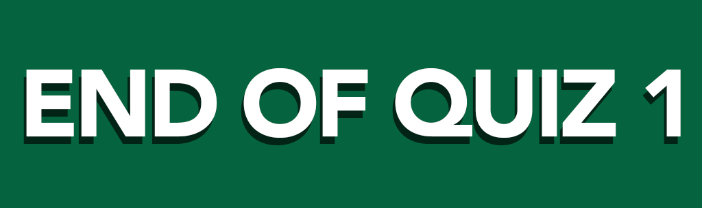 

- **Recursive Algorithms**
  - An algorithm is called recursive if it solves a problem by reducing it to an instance of the same problem with smaller input.
  - Examples:
    - [1] Give a recursive algorithm for computing n!, where n is a nonnegative integer.<br>
    ``` procedure factorial(n: nonnegative integer)``` <br>
    ```if n = 0 then return 1``` <br>
    ```else return n · factorial(n − 1)``` <br>
    - [2] Give a recursive algorithm for computing a<sup>n</sup>, where a is a nonzero real number and n is a nonnegative integer.
    ``` procedure power(a: nonzero real number, n: nonnegative integer)``` <br>
    ```if n = 0 then return 1``` <br>
    ```else return a · power(a, n − 1)``` <br>

## Week 7:

- **Introduction to Set Theory** - a set is an unordered collection of distinct objects, which may be anything.
    - {a, b, d, c, f, e}
  - Empty Set { } = ∅ means no elements
    - {∅} not an empty set
  - Set Builder Notation 
    - {x | some property that x satisfies}
  - Membership
    - 1 ∈ {1, 3, 5, 7}
- **Set Identities**

|  **Laws**  |  **Identity**  |
| :------: | :-----------------------------: |
|  Identity Laws  |  A ⋂ U ≡ A  <br>  A ⋃ ∅ ≡ A  |
|  Domination Laws  |  A ⋃ U ≡ U  <br>  A ⋂ ∅ ≡ ∅  |
|  Idempotent Laws  |  A ⋃ A ≡ A  <br>  A ⋂ A ≡ A  |
|  Complementation Law  |  (A¯)‾ ≡ A  |
|  Commutative Laws  |  A ⋃ B ≡ B ⋃ A  <br>  A ⋂ B ≡ B ⋂ A  |
|  Associative Laws  |  A ⋃ (B ⋃ C) ≡ (A ⋃ B) ⋃ C  <br>  A ⋂ (B ⋂ C) ≡ (A ⋂ B) ⋂ C  |
|  Distributive Laws  |  A ⋃ (B ⋂ C) ≡ (A ⋃ B) ⋂ (A ⋃ C) <br>  A ⋂ (B ⋃ C) ≡ (A ⋂ B) ⋃ (A ⋂ C)  |
|  De Morgan's Laws  |  (A ⋂ B)‾ ≡ A‾ ⋃ B‾  <br>  (A ⋃ B)‾ ≡ A‾ ⋂ B‾  |
|  Absorption Laws  |  A ⋃ (A ⋂ B) ≡ A  <br>  A ⋂ (A ⋃ B) ≡ A  |
|  Complement Laws  |  A ⋃ A‾ ≡ U  <br>  A ⋂ A‾ ≡ ∅  |

- **Subsets** (⊆) - A set S is a subset of a set T (denotes S ⊆ T) if all elements of S are also elements of T.
- **Power Set** P(S) = {T|T ⊆ S}
- **Cardinality** - the cardinality of a set is the number of element it contains.
- **Functions**
  - Let A and B be sets. A function f from A to B is an assignment of exactly one element of B to each element of A.
  - also called *mappings* or *transformations*.
- **Types of Functions**
    - One-to-one Function (Injection) - functions that never assign the same value to two different domain elements.
    - Onto Function (Surjective) - functions have equal range & co-domain.
    - One-to-one Correspondence (Bijection) - function is both one-to-one and onto.

## Week 8: 

- **Algorithms**
  - It is defined as a finite set of precise instructions for performing a computation or for solving a problem.
  - **Properties of Algorithms**
    - Input: An algorithm has input values from a specified set.
    - Output: From each set of input values an algorithm produces output values from specified set. The output values are the solution to the problem.
    􏰽- Definiteness: The steps of an algorithm must be defined precisely.
    - Correctness: An algorithm should produce the correct output values for each set of input values.
    - Finiteness: An algorithm should produce the desired output after a finite (but perhaps large) number of steps for any input in the set. 
    - Effectiveness: It must be possible to perform each step of an algorithm exactly and in a finite amount of time.
    - Generality: The procedure should be applicable for all problems of the desired form, not just for a particular set of input values.
- **Pseudocode** serves as an intermediate step in the construction of programs implementing algorithms in one of a variety of different programming languages. 
- *A key difference between this pseudocode and code in a programming language is that we can use any well-defined instruction even if it would take many lines of code to implement this instruction.*
- Preconditions/Postconditions
  - Preconditions - statements that describe the valid input 
    - Ex. {a<sub>1</sub>, A<sub>2</sub>, ..., a<sub>n</sub>} ∈ ℤ
  - Postconditions - conditions that the output should satisfy when the program has run
    - Ex. Output: MAX - largest number
- **Searching Algorithms**
  - Linear Search (or Sequential Search) <br>
  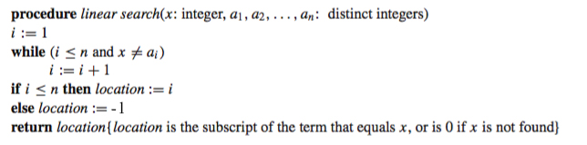 
  - Binary Search <br>
  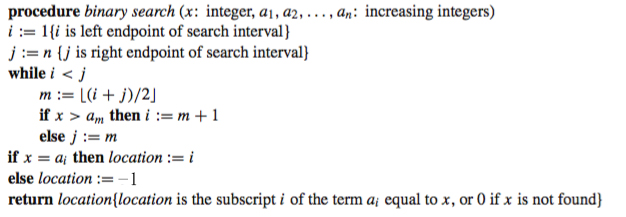 
- **Sorting Algorithms**
  - Bubble Sort <br>
  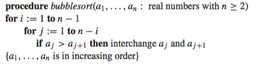 
  - Insertion Sort <br>
  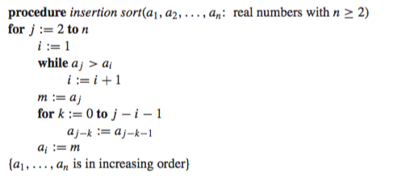
<br>Outer *for* loop means j<sup>th</sup> iterations. *While* loop is used for looking the location. Inner *for* loop provides the "movement" of two values.<br>
- **Iteration table** plays a big role in devising an algorithm as it lessens confusion.

## Week 9:
- **Greedy Algorithms** – algorithms that make what seems to be the “best” choice at each step 
- **Growth of Functions**
  - **Big-O Notation**: Let f and g be functions from the set of integers or the set of real numbers to the set of real numbers. We say that f(x) is O(g(x)) if there are constants C and k such that |f (x)| ≤ C|g(x)| whenever x > k. 
    - Introduced two witnesses: C (constant multiplier) and k (# of input values). 
    - Graph: Complexity (no. of operations) v. Input 
    - O(n) - upperbound notation
    - Lesser complexity provides better algorithm. 
    - A Display of the Growth of Functions Commonly Used in Big-O Estimates: <br>
     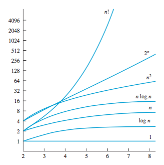

##Week 10:
- Continuation on **Growth of Functions**
	- **Big-Omega & Big-Theta Notations**: This is the reason why Sir Melvin said that "Big O is important but not useful in the quiz." These notations was the common misuse of big-O notation when both an upper and a lower bound on the size of a function are needed.
	- **Big-Omega Notation**: Let f and g be functions from the set of integers or the set of real numbers to the set of real numbers. We say that f(x) is 􏰰(g(x)) if there are positive constants C and k such that |f(x)| ≥ C|g(x)| whenever x > k. It provides the lower bound for the size of f(x).
	- **Big-Theta Notation**: It provides the upper and lower bound for the size of f(x).
- **Complexity of Algorithms**
  - They can be expressed in terms of the number of operations used by the algorithm when the input has a particular size.
  - "Questions such as these involve the **computational complexity** of the algorithm. An analysis of the time required to solve a problem of a particular size involves the **time complexity** of the algorithm. An analysis of the computer memory required involves the **space complexity** of the algorithm." (Rosen, 2012)
- **Division and Modulo Operator**
  - *The Division Algorithm*: Let a be an integer and d a positive integer. Then there are unique integers q and r, with 0 ≤ r < d, such that a = dq + r.
  	- q = a div d
  	- r = a mod d

<br> 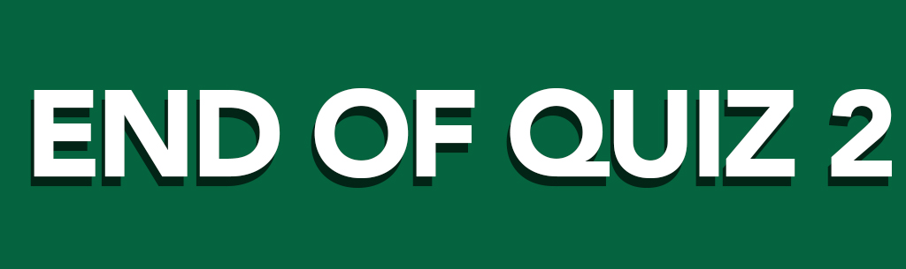 

##Week 11:
<br>  

##Week 12:
- **Graph Theory** 
	- A *graph* G = (V,E) consists of V, a nonempty set of *vertices* (or nodes) and E, a set of *edges*. Each edge has either one or two vertices associated with it, called its endpoints. An edge is said to connect its endpoints.
	- Application
		- Social and economic networks: A set of people or groups of people with some pattern of contacts or interactions between them.
			- Facebook, friendship networks, business relations between companies, intermarriages between families, labor markets (Source: Daron Acemoglu and Asu Ozdaglar's Lecture on Graph Theory, MIT 2009)
	- A graph with an infinite vertex set or an infinite number of edges is called an *infinite graph*, and in comparison, a graph with a finite vertex set and a finite edge set is called a *finite graph*.
	- **Simple graph vs. Multigraph**
		- Simple graph – a graph in which each edge connects two different vertices and where no two edges connect the same pair of vertices
		- Multigraphs – graphs that may have multiple edges connecting the same vertices 
	- A directed graph (or digraph) (V,E) consists of a nonempty set of vertices V and a set of directed edges (or arcs) E. Each directed edge is associated with an ordered pair of vertices. The directed edge associated with the ordered pair (u, v) is said to start at u and end at v.
	- **Graph Terminology**<br>
	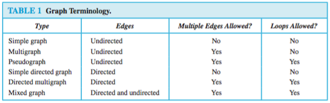 
	- **Special Simple Graphs**<br>
		- Complete Graphs (Kn): A complete graph on n vertices.
		<br> 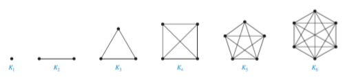 
		- Cycle (Cn): Cycles A cycle Cn, n ≥ 3, consists of n vertices v1, v2, . . . , vn and edges {v1, v2}, {v2, v3}, . . . , {vn−1, vn}, and {vn, v1}.
		<br> 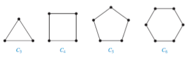 
		- Wheels (Wn): An additional vertex is added to a cycle Cn, for n ≥ 3. It is connected to the new vertex to each of the n vertices in Cn, by new edges.
		<br> 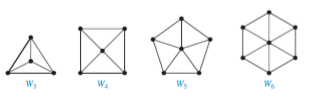 
		- n-Cubes (Qn):
		<br> 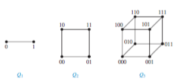 
	- The *degree* of a vertex in an undirected graph is the number of edges incident with it, except that a loop at a vertex contributes twice to the degree of that vertex. The degree of the vertex v is denoted by deg(v).
		- **The Handshaking theory**: 2e = ∑deg(v)
		- An undirected graph has an even number of vertices of odd degree.
	- **Bipartite Graphs**: A simple graph G is called bipartite if its vertex set V can be partitioned into two disjoint sets V1 and V2 such that every edge in the graph connects a vertex in V1 and a vertex in V2 (so that no edge in G connects either two vertices in V1 or two vertices in V2). When this condition holds, we call the pair (V1, V2) a bipartition of the vertex set V of G.
	- **Isolated vs. Pendant**
		- Isolated - vertex with 0 degree
		- Pendant - vertex with one degree
	- **Path** - sequence of edges travelling from vertex to vertex along the edges
	- **Eulerian**
		- Euler Circuit - passes through every edge and goes back to starting point. All vertex has a degree of **2**.
		- Euler Path - simple path containing every edge of the graph. Exactly **2** vertices have an odd degree.
	- **Hamiltonian**
		- Hamilton Path - passes through every vertex
		- Hamilton Circuit - passes through every vertex then goes back to the starting point
	- **Matrices of Graphs**
		- Adjacency Matrix: 1 if adjacent to the chosen vertex; 0 if non-adjacent
		- Incidence Matrix: 1 when edge is incident with chosen vertex; 0 otherwise
	- **Planar Graph**
		- Euler's Formula: r = e - v + 2
			- r - regions
			- e - edges
			- v - vertices
		- Euler's Characteristic: ℵ = r - |e| + |v| = 2
	- **Isomorphism vs. Homeomorphism**
		- [PLANAR] *Isomorphic Graph*: The graphs are isomorphic if there exists a one-to-one and onto function f from V1 to V2 with the property that a and b are adjacent in G1 if and only if f (a) and f (b) are adjacent in G2, for all a and b in V1. Such a function f is called an isomorphism. They have the *same connection, equal nodes and vertices*.
		- [NON-PLANAR] *Homeomorphic Graph*: The graphs are homeomorphic to each other if they can be obtained from the same graph by a sequence of elementary subdivisions.
			- [Kuratowski's Theorem] A graph is nonplanar if and only if it contains a subgraph homeomorphic to K3,3 or K5.

<br>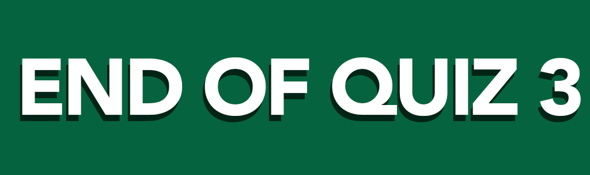 

##Week 13:
- Continuation on **Graph Theory**.
	- *Graph Coloring*: A coloring of a simple graph is the assignment of a color to each vertex of the graph so that no two adjacent vertices are assigned the same color.
	- The **chromatic number** (χ) of a graph is the least number of colors needed for a coloring of this graph. 
	- **Four Color Theorem**: The chromatic number of a planar graph is no greater than four.
- **Trees**
	- A **tree** is a connected undirected graph with no simple circuits.
	- A **rooted tree** is a tree in which one vertex has been designated as the root and every edge is directed away from the root.
		- An **ordered rooted tree** is a rooted tree where the children of each internal vertex are ordered. 
		- **leaves** - nodes that do not have children
		- **ancestors** - nodes on top
		- **descendants** - children/grandchildren
	- **M-ary tree**: A rooted tree is called an m-ary tree if every internal vertex has no more than m children. The tree is called a full m-ary tree if every internal vertex has exactly m children. 
	- **Properties of Trees**
		- A tree with n vertices has n − 1 edges.
		- A full m-ary tree with i internal vertices contains n = mi + 1 vertices.
		- A full m-ary tree with
			- n vertices has i = (n − 1)/m internal vertices and l = [(m − 1)n + 1]/m leaves
			- i internal vertices has n = mi + 1 vertices and l = (m − 1)i + 1 leaves
			- l leaves has n = (ml − 1)/(m − 1) vertices and i = (l − 1)/(m − 1) internal ver- tices.
- **Modeling Computation**
	- *Vocabulary/Word*: A vocabulary (or alphabet) V is a finite, nonempty set of elements called symbols. A word (or sentence) over V is a string of finite length of elements of V . The empty string or null string, denoted by λ, is the string containing no symbols. The set of all words over V is denoted by V∗. A language over V is a subset of V∗.
	- *Phrase-structure grammar*: A phrase-structure grammar G=(V,T,S,P) consists of a vocabulary V, a subset T of V consisting of terminal symbols, a start symbol S from V , and a finite set of pro- ductions P . The set V − T is denoted by N . Elements of N are called nonterminal symbols. Every production in P must contain at least one nonterminal on its left side.
	- **Derivation** -generated by a context-free grammar can be represented graphically using an ordered rooted tree
	- According to Kenneth Rosen, the author of the book of "Discrete Mathematics and Its Application", the syntax of a **natural language**, that is, a spoken language, such as English, French, German, or Spanish, is extremely complicated. In fact, it does not seem possible to specify all the rules of syntax for a natural language. Research in the automatic translation of one language to another has led to the concept of a **formal language**, which, unlike a natural language, is specified by a well-defined set of rules of syntax. Rules of syntax are important not only in linguistics, the study of natural languages, but also in the study of programming languages.

##Week 14:
<br>  
